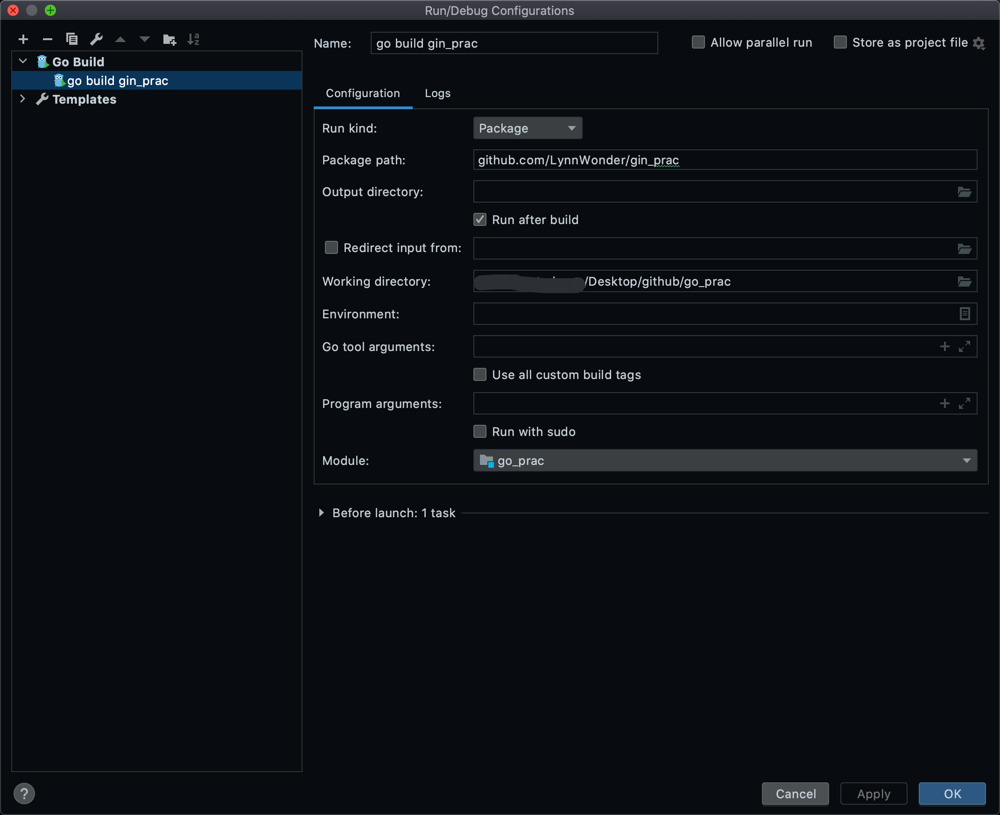

# gin_practices
> 一个简单的增删改查 gin 项目
> 
> gin 处理 http 请求和 tcp 连接的模块实际上是 golang 的 net/http 模块，gin 实则是丰富了 net/http 做路由匹配部分的能力以及其他一些能力。
## 项目目录结构

> 在 golang 中，每一个目录即是一个包，每个包都是一等公民，因此不会出现像其他语言一样的 src 目录。

```plain
.
├── README.md
├── biz
│   ├── common
│   │   └── global.go
│   ├── config
│   │   ├── config.go 注册 logger，解析配置文件到 AppConfig 中
│   │   └── logger.go
│   ├── dal
│   │   ├── gorm.go
│   │   └── person
│   │       └── person.go
│   ├── handler
│   │   ├── error.go
│   │   ├── handler.go
│   │   └── person
│   │       └── person.go
│   ├── model
│   │   └── person.go
│   ├── middleware
│   └── service
│       └── person
│           ├── errors.go
│           └── person.go
├── conf
│   └── default.yaml
├── go.mod   标记每一个依赖包的版本，整理时 go mod tidy 
├── go.sum   记录每个依赖包的哈希值，这里不需要太过关注
├── img.png
├── logs
│   └── gin-prac.log
├── main.go
├── router   初次练习时用的路由，无需注意
│   ├── api
│   │   ├── index.go
│   │   └── userRouter
│   │       ├── auth.go
│   │       └── index.go
│   └── router.go
└── router.go    
    
```
1. conf 文件夹存基础配置文件
2. biz 文件夹，业务逻辑的组装层，类似于 DDD 的 domain 层
   - biz/common 存放常量和全局变量
   - biz/config 解析 yaml 文件、初始化日志收集等
3. biz/dal 文件夹，编写数据访问层
4. 注册路由 router.go
5. biz/handler handler 函数
6. biz/service 文件夹，类似于 DDD 的 application 层，实现从 handler 向 dal 的过渡

## 项目启动
配置 goland 启动

项目使用了 kitex(RPC 框架)，其底层实现了 Serialization 序列化和 Transport 传输。
具体看 rpc 路由，需提前启动服务端应用，参考 rpc/README.md 
背景知识：
- kitex 框架和命令行工具默认支持 thrift 和 proto3 两种 IDL，对应的 kitex 支持 thrift 和 protobuf 两种序列化协议。 
  
- 在传输上 kitex 使用扩展的 thrift 作为底层传输协议（thrift 既是 IDL 格式也是序列化协议和传输协议）

注：
IDL 即 interface definition Language 为接口定义语言，是用来约定进行 rpc 的双方的语言。



或
```golang
go run main.go
// 最简单的一个路由
// 127.0.0.1:8080/api/user-auth/login
```

## TODO
- handler chain 的概念

## reference
[Gorm docs](https://gorm.io/zh_CN/docs)
[gin 源码阅读(1) - gin 与 net/http 的关系](https://www.cnblogs.com/457220157-FTD/p/15331188.html)

